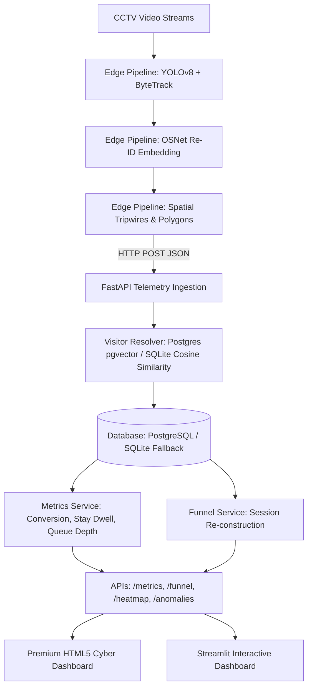

# System Architecture & Design Specification: Store Intelligence Platform

This document describes the system architecture, pipelines, databases, and algorithms designed for the **Store Intelligence Platform** to analyze physical retail shopper metrics (traffic counts, stay dwell times, conversion rates, and queue bottlenecks) from CCTV cameras.

---

## 1. High-Level System Architecture

The platform follows a decoupled **Edge-to-Cloud architecture**, where edge cameras process raw video feeds and stream telemetry events to a centralized API server, which computes business analytics and serves dashboards.

---

## 2. Component Design & Pipeline Mechanics

### A. Edge Detection & Tracking Pipeline (`pipeline/`)
1. **Person Detection & Tracking**: Uses a quantized **YOLOv8** model for high-precision bounding-box detections of shoppers, feeding coordinates to **ByteTrack** for persistent target tracking across frames.
2. **Spatial Containment & Crossing**:
   * **Polygon Containment**: Implements a ray-casting algorithm (`point_in_polygon`) to verify if a shopper's bottom-center coordinate is inside custom retail zones (CAM1 for skincare, CAM2 for makeup, CAM5 for billing queue).
   * **Tripwire Crossing**: Tracks shopper coordinate intersections across a vector line segment (`check_tripwire_crossing`) to count `ENTRY` and `EXIT` triggers.
3. **Event Serialization**: Formats coordinates, confidence scores, timestamps, and zone properties into standardized schemas.

### B. Cloud Telemetry Ingestion & Visual Re-ID Resolver (`app/main.py`)
1. **Dynamic Database Connectivity**: A bootstrap manager checks PostgreSQL connectivity with a 3-second probe timeout. If unreachable (e.g. disk/Docker issues), it activates the local SQLite file (`store_intelligence.db`) and seeds store coordinates (`ST1008`) and cameras.
2. **Person Re-ID Embedding Mapping**:
   * Extracts a 512-dimension visual signature using OsNet.
   * **PostgreSQL Mode**: Casts list embeddings to native `vector(512)` and executes nearest-neighbor queries using cosine distance operators (`<=>`) over a 4-hour temporal search window.
   * **SQLite Fallback Mode**: Performs an in-memory cosine similarity calculation in Python using dot product formulas to match tracking profiles if the distance is $\le 0.15$ (similarity $\ge 0.85$).
   * Creates a new visitor profile if no matches exist.

### C. Analytical Business Logic & Service Layers (`app/services/`)
1. **Retail Metrics (`metrics_service.py`)**:
   * **Unique Visitors**: Count of distinct visitors detected inside the store (non-staff).
   * **Conversion Rate**: $\frac{\text{Unique Visitors with Transactions}}{\text{Total Unique Visitors}} \times 100.0$.
   * **Avg Dwell Time**: Average session stay duration in minutes.
   * **Queue Depth**: Count of active shoppers who joined the billing queue (CAM5) but have not yet exited or abandoned it.
   * **Queue Abandonment**: $\frac{\text{Queue Abandons}}{\text{Total Queue Joins}} \times 100.0$.
2. **Funnel Aggregation (`funnel_service.py`)**:
   * **Session Reconstruction**: Groups raw events into discrete shopper visits. A new session is created if a visitor exits or is inactive for > 30 minutes (re-entry handling).
   * **Leeway Transaction Matching**: Maps a transaction to a visit session if its timestamp matches the visit window (`[session_start - 5m, session_end + 30m]`).
   * **Sequential Progression**: Enforces step-by-step conversion tracking to guarantee a clean, monotonically decreasing funnel:
     $$\text{Entry (Stage 1)} \rightarrow \text{Zone Interaction (Stage 2)} \rightarrow \text{Billing Queue Join (Stage 3)} \rightarrow \text{Purchase (Stage 4)}$$

### D. Production Readiness & Observability
* **FastAPI Server**: Mounts dashboards as static routes, implements custom validation exception handlers, and outputs structured **JSON logging** to stdout.
* **Testing**: Features a complete pytest suite verifying endpoints, re-entry logic, empty store anomalies, and division-by-zero protections.
